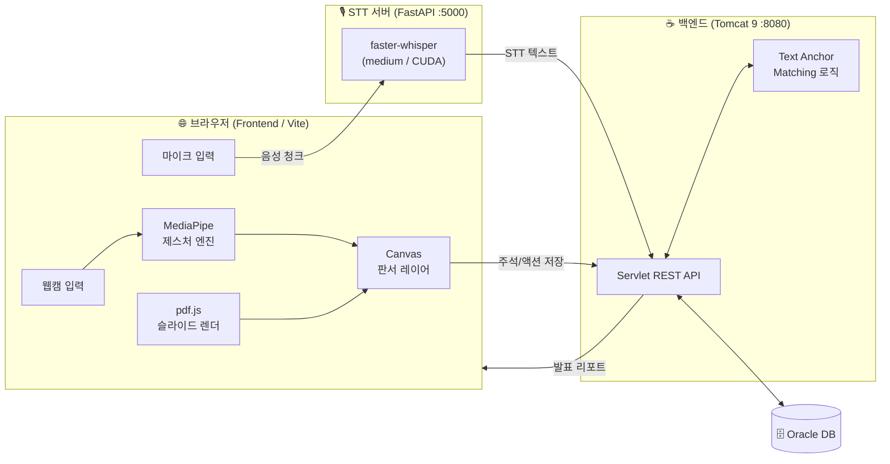
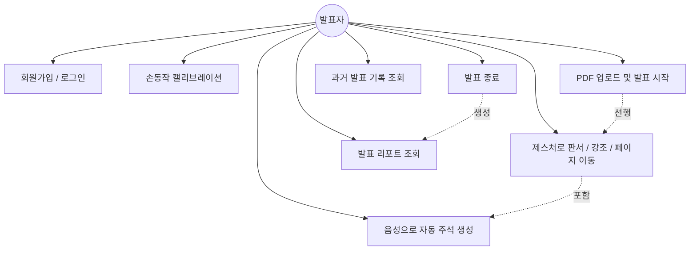
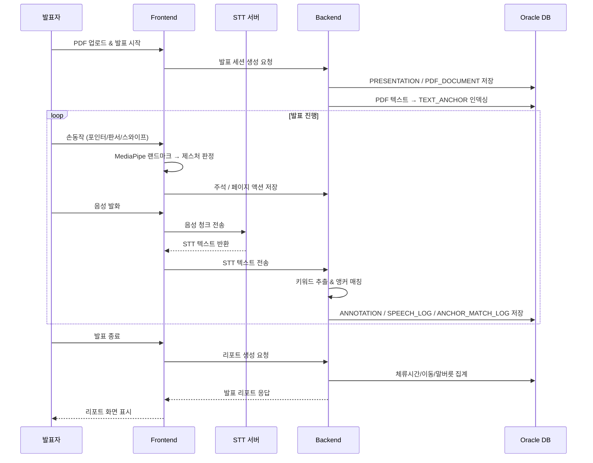
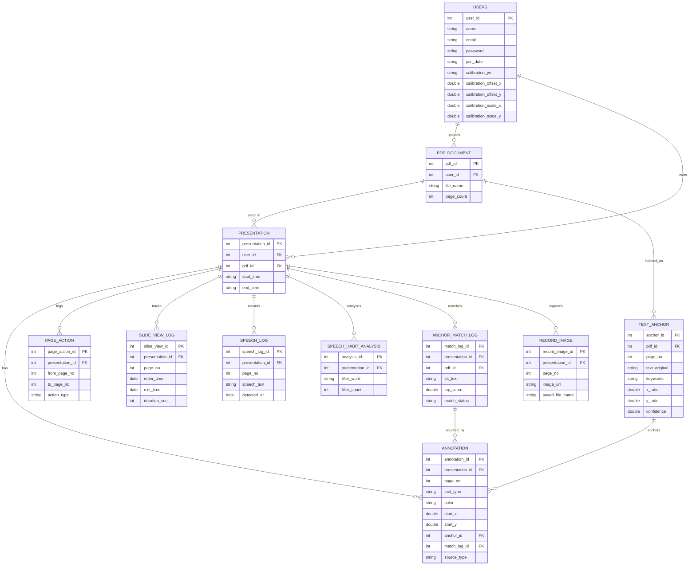
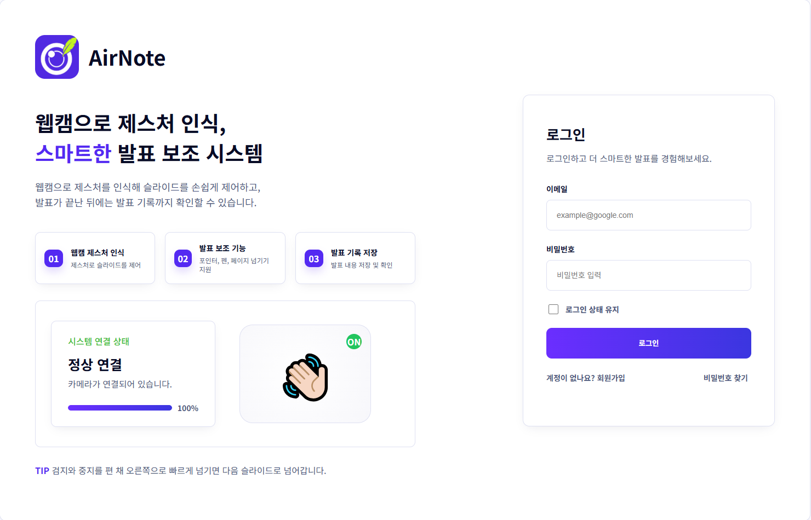
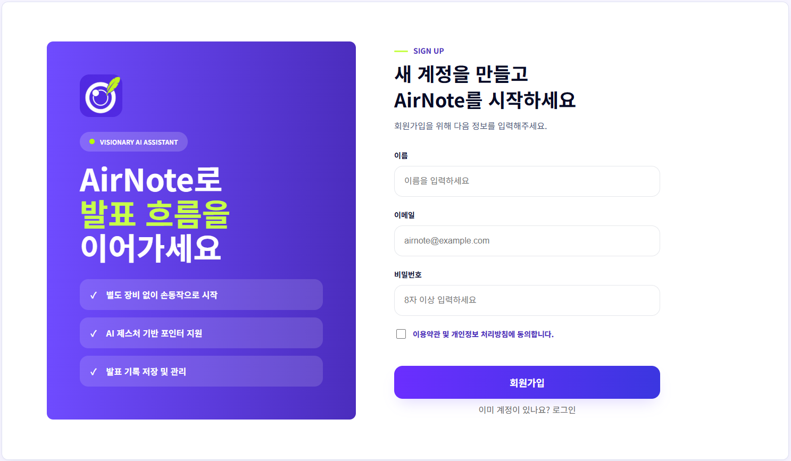
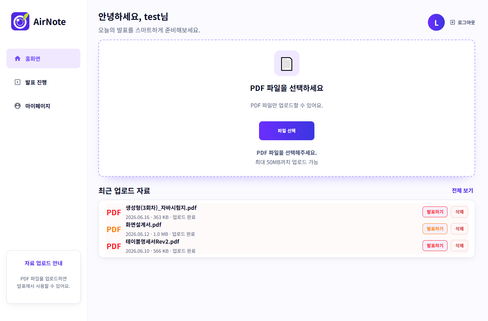
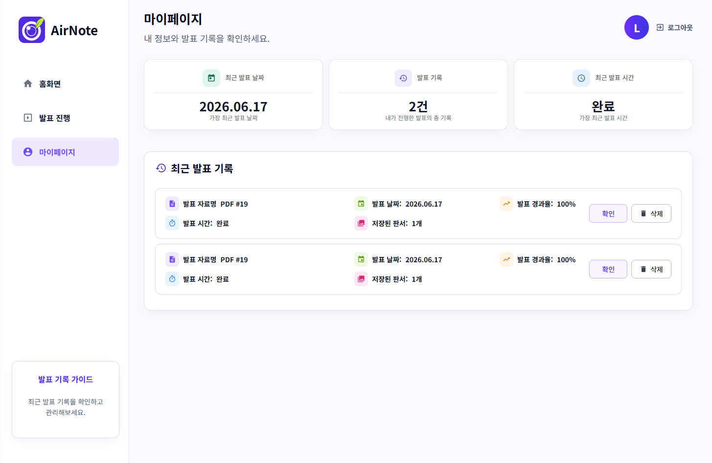
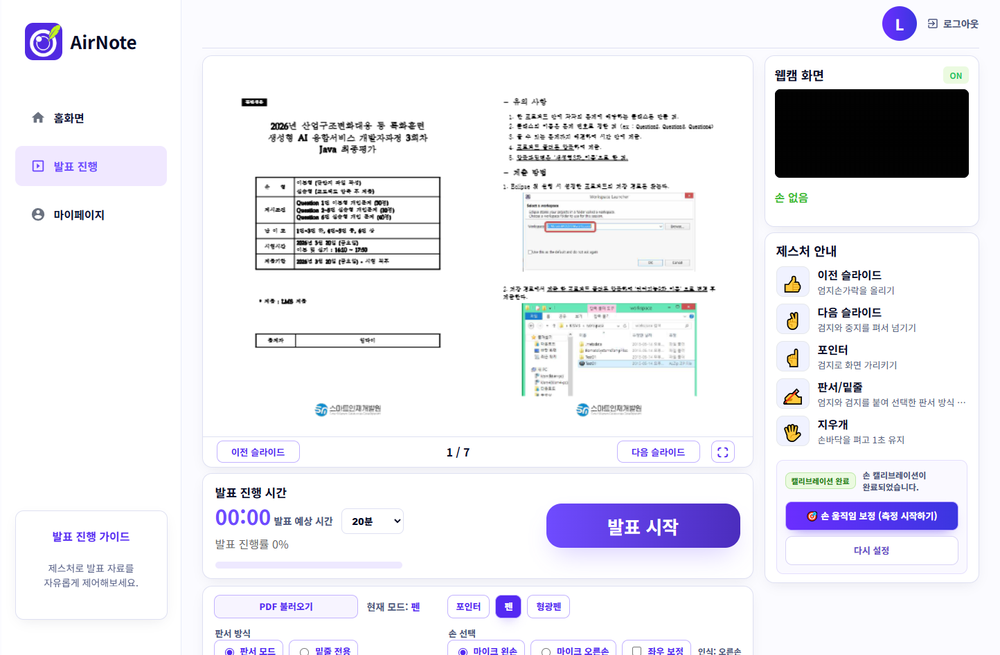

<div align="center">

# ✋ AirNote

### 손동작과 목소리로 발표하는 차세대 발표 보조 서비스

> 마우스도, 포인터도, 펜도 없이.
> **카메라 앞에서 손을 움직이면 슬라이드에 판서가 되고, 말하면 그 내용이 자동으로 슬라이드에 기록됩니다.**

**팀명 : 칠판안사조**

</div>

---

## 📑 목차

1. [프로젝트 소개](#1-프로젝트-소개)
2. [서비스 소개](#2-서비스-소개)
3. [프로젝트 기간](#3-프로젝트-기간)
4. [주요 기능](#4-주요-기능)
5. [기술 스택](#5-기술-스택)
6. [시스템 아키텍처](#6-시스템-아키텍처)
7. [유스케이스](#7-유스케이스)
8. [서비스 흐름도](#8-서비스-흐름도)
9. [ER 다이어그램](#9-er-다이어그램)
10. [화면 구성](#10-화면-구성)
11. [팀원 역할](#11-팀원-역할)
12. [트러블슈팅](#12-트러블슈팅)

---

## 1. 프로젝트 소개

| 항목 | 내용 |
| --- | --- |
| **프로젝트명** | AirNote |
| **팀명** | 칠판안사조 |
| **한 줄 소개** | 웹캠 손 제스처 + 실시간 음성 인식 기반 발표 판서·주석 서비스 |
| **개발 인원** | 4명 |
| **소속** | 스마트인재개발원 (2026-SMHRD-IS-GAI-3) |

발표자는 슬라이드에 강조 표시를 하기 위해 매번 마우스를 잡거나 레이저 포인터를 들어야 합니다.
**AirNote는 그 모든 도구를 "맨손"과 "목소리"로 대체합니다.**
웹캠으로 손동작을 인식해 포인터·밑줄·형광펜·지우개를 제어하고, 발표 음성을 실시간으로 텍스트화해
발표 내용과 슬라이드의 위치를 자동으로 매칭하여 주석을 남깁니다.

---

## 2. 서비스 소개

> **"발표에만 집중하세요. 기록은 AirNote가 합니다."**

- 🖐 **제스처 판서** — 손가락으로 가리키고, 밑줄 긋고, 형광펜으로 강조하고, 손바닥으로 지웁니다.
- 🎙 **음성 자동 주석** — 발표 중 말한 내용을 STT로 인식하고, 발화한 키워드가 위치한 슬라이드 영역에 자동으로 주석을 배치합니다 (Text Anchor Matching).
- 📄 **PDF 발표** — pdf.js 기반으로 별도 변환 없이 PDF를 그대로 발표 자료로 사용합니다.
- 🎯 **개인 캘리브레이션** — 사용자별 카메라·캔버스 좌표 보정값을 저장해 손동작 인식 정확도를 높입니다.
- 📊 **발표 리포트** — 발표 종료 후 슬라이드별 체류 시간, 페이지 이동 횟수, 주석 통계, 말버릇(필러워드) 분석 리포트를 제공합니다.

---

## 3. 프로젝트 기간

**2026.05 ~ 2026.06**

---

## 4. 주요 기능

### 🖐 제스처 인식 판서 엔진
- MediaPipe `hand_landmarker` 기반 21개 손 랜드마크 실시간 추적
- **포인터** : 검지로 화면을 가리키는 레이저 포인터
- **자유 판서 / 직선 밑줄** : 손가락 궤적을 따라 필기 (`freeWritingEngine`, `straightUnderlineEngine`)
- **형광펜 / 밑줄 강조**
- **손바닥 지우기** (`palmEraseGesture`) 및 최근 획 삭제 (`recentStrokeDeletion`)
- **스와이프 페이지 넘김** (`swipeGesture`)

### 🎙 실시간 음성 인식 (STT)
- `faster-whisper medium` 모델 기반 한국어 STT (FastAPI 서버)
- CUDA GPU 가속 (`int8_float16`), GPU 미지원 시 CPU 폴백
- 로컬 모델 전용 모드(`LOCAL_MODEL_ONLY`)로 오프라인 동작 보장

### 🎯 음성-슬라이드 자동 매칭 (Text Anchor Matching)
- PDF 텍스트를 추출해 위치 정보를 가진 **Text Anchor**로 인덱싱
- STT 결과에서 키워드를 추출 → 앵커와 매칭 점수 계산 → 임계값/모호도 기반 판정
- 매칭 결과(점수, 후보 수, 실패 사유 등)를 `ANCHOR_MATCH_LOG`에 기록해 정확도 추적

### 📊 발표 리포트
- 총 발표 시간 / 가장 오래 머문 슬라이드 / 페이지 이동 횟수
- 도구별 주석 통계 (포인터·형광펜·밑줄·지우개)
- 말버릇(필러워드) 빈도 분석

### 👤 사용자 관리
- 회원가입 / 로그인
- 개인별 손동작 캘리브레이션 값 저장 (offset / scale / mirror / 해상도)

---

## 5. 기술 스택

### Frontend


- Vanilla JS (ES Modules), Canvas API, IndexedDB
- **MediaPipe Tasks Vision** (`@mediapipe/tasks-vision`) — 손 랜드마크 인식
- **pdf.js** (`pdfjs-dist`) — PDF 렌더링

### STT Server


- FastAPI, faster-whisper (medium), CUDA Runtime

### Backend


- Java Servlet / JSP, JDBC

### Database


### Tools & Test


- Vitest (단위 테스트), Playwright (통합 테스트), GitHub Actions (CI)

---

## 6. 시스템 아키텍처



---

## 7. 유스케이스



---

## 8. 서비스 흐름도



---

## 9. ER 다이어그램



---

## 10. 화면 구성

### 🎬 시연 영상

https://github.com/2026-SMHRD-IS-GAI-3/Noblackboard/raw/main/docs/airnote-demo.mp4

> 영상이 보이지 않으면 ▶ [시연 영상 다운로드/재생](docs/airnote-demo.mp4)

### 핵심 화면

화면설계서 기준 5개 핵심 화면으로 구성됩니다. (사용자 동선: 로그인·회원가입 → 홈/업로드 → 발표 진행 → 마이페이지)

| 화면 ID | 화면 | 설명 |
| --- | --- | --- |
| `AUTH_LOGIN_01` | 로그인 | 이메일·비밀번호 로그인, 카메라 연결 상태 확인 후 홈 이동 |
| `AUTH_SIGNUP_01` | 회원가입 | 이름·이메일·비밀번호·약관 동의로 신규 계정 생성 |
| `HOME_UPLOAD_01` | 홈 / 파일 업로드 | PDF 발표 자료 업로드, 최근 자료 목록에서 발표 시작 |
| `PRESENT_RUN_01` | 발표 진행 | PDF 슬라이드 뷰어 + 웹캠 손 인식 + 제스처/캘리브레이션/판서 + 발표 시간 표시 |
| `MYPAGE_RECORD_01` | 마이페이지 | 발표 요약 카드, 발표 기록(자료명·날짜·판서 수) 조회·상세·삭제 |

|  |  |
| :---: | :---: |
| **로그인** | **회원가입** |
|  |  |
| **홈 / 파일 업로드** | **마이페이지** |

|  |
| :---: |
| **발표 진행** — PDF 슬라이드 · 웹캠 손 인식 · 제스처 안내 · 발표 시간 |

---

## 11. 팀원 역할

| 이름 | 역할 | 담당 업무 |
| :---: | :---: | --- |
| **정연석** | PM / AI | 프로젝트 총괄·일정 관리, MediaPipe 손 인식 모델링 및 제스처 판정 로직 설계 |
| **장지선** | Backend / DB | Java Servlet REST API, Text Anchor Matching, 발표 리포트, Oracle DB 설계·연동 |
| **임보람** | Frontend / STT | UI/UX 및 발표 화면 구현, pdf.js 연동, faster-whisper 기반 STT 서버 구축 |
| **백경석** | 문서화 | 프로젝트 산출물·기획 문서 작성, 발표 자료 및 README 문서화 |

---

## 12. 트러블슈팅

<table>
<tr>
<td width="30%"><b>🖐 손 제스처 오인식</b></td>
<td>

**문제** — 손떨림이나 순간적인 손 모양 변화가 의도하지 않은 판서·페이지 넘김으로 잘못 실행됨.

**해결** — 제스처마다 **쿨다운·홀드·유예(grace) 시간**을 둔 상태 전이 로직으로, 일정 시간·프레임 이상 유지된 동작만 명령으로 인정해 오인식을 제거.

</td>
</tr>

<tr>
<td><b>🎯 손 좌표와 화면 불일치</b></td>
<td>

**문제** — 웹캠 해상도·캔버스 해상도·좌우 반전(미러) 차이로 손 위치와 실제 판서 지점이 어긋남.

**해결** — 사용자별 **캘리브레이션 값**(offset·scale·mirror, 카메라·캔버스 해상도)을 저장하고 발표 시 좌표를 정규화해 환경마다 일관된 인식 정확도 확보.

</td>
</tr>

<tr>
<td><b>🎙 STT 잡음·단어 끊김</b></td>
<td>

**문제** — 무음·잡음 구간까지 인식되어 엉뚱한 텍스트가 생기고, 음성을 청크 단위로 끊어 보낼 때 경계의 단어가 잘림.

**해결** — 음량 특성(peak·crest·dynamic) 기준으로 **비음성 구간을 걸러내고**, 청크에 **겹침(overlap) 구간**을 두어 경계 단어 손실을 방지. 환경에 따라 **GPU→CPU 자동 폴백**으로 동작 보장.

</td>
</tr>

<tr>
<td><b>🧭 음성-슬라이드 주석 위치 모호</b></td>
<td>

**문제** — 발화 내용이 슬라이드의 여러 텍스트와 비슷해 주석이 엉뚱한 위치에 찍힘.

**해결** — PDF 텍스트를 위치 기반 **Text Anchor**로 인덱싱하고, **매칭 점수·후보 간 점수 차·임계값**으로 판정. 모호하면 주석을 만들지 않고 매칭 로그로 남겨 정확도를 추적·개선.

</td>
</tr>

<tr>
<td><b>💾 발표 중 주석 유실</b></td>
<td>

**문제** — 발표 도중 네트워크가 끊기면 그 사이 생성된 판서·주석이 저장되지 못하고 사라짐.

**해결** — 주석을 **로컬 큐에 버퍼링**한 뒤 연결이 복구되면 **자동 재전송(flush)**, 실패분은 큐에 남겨 재시도하여 데이터 유실을 방지.

</td>
</tr>
</table>

---

## 🚀 실행 방법

```bash
# Frontend + STT (Windows)
#   setup.bat   : Node/Python/Java 확인 및 의존성 설치, STT 모델 준비
#   run_all.bat : STT 서버(:5000) + 프론트 dev 서버(:5173) 동시 실행
cd Front_engine_split_gesture_fix
setup.bat
run_all.bat
# 브라우저에서 http://localhost:5173/pages/presentation.html 접속
```

> 백엔드(Tomcat) 및 Oracle 연결 설정은 `src/main/resources/db.properties`와 `backend.local.env.example`을 참고하세요.

<div align="center">

**칠판안사조 · AirNote**

</div>
